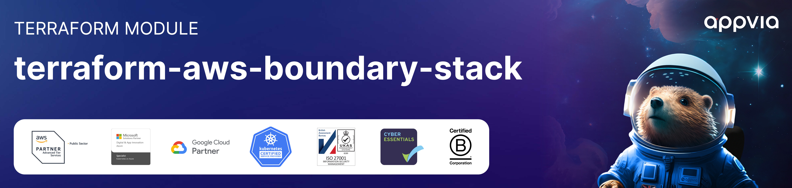
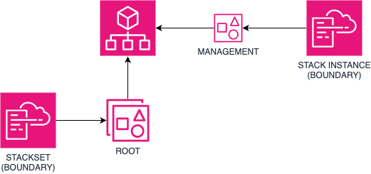

<!-- markdownlint-disable -->
<a href="https://www.appvia.io/"></a><br/><p align="right"> <a href="https://registry.terraform.io/modules/appvia/boundary-stack/aws/latest"></a></a> <a href="https://github.com/appvia/terraform-aws-boundary-stack/releases/latest"></a> <a href="https://appvia-community.slack.com/join/shared_invite/zt-1s7i7xy85-T155drryqU56emm09ojMVA#/shared-invite/email"></a> <a href="https://github.com/appvia/terraform-aws-boundary-stack/graphs/contributors"></a>

<!-- markdownlint-restore -->
<!--
  ***** CAUTION: DO NOT EDIT ABOVE THIS LINE ******
-->


# Terraform AWS IAM Boundary Stack

<p align="center">
  </br></br>
  
</p>

## Description

The purpose of this module is to provide a convenient method of deploying IAM boundaries to all AWS accounts within an AWS Organization, including the management account. The method effectively wraps a cloudformation stackset, and deploy to the organization root. Note, since stacksets are not deployed to the management account, the same functionality is deployed your a single cloudformation stack.

## Usage

```hcl
module "boundary" {
  source = "../.."

  description               = "Used to deploy the default permissions boundary for the pipelines."
  enable_management_account = true
  name                      = "LZA-IAM-DefaultBoundary"
  region                    = "us-west-2"
  tags                      = {}
  template                  = file("assets/default-boundary.yml")
  parameters                = {}
}
```

## Update Documentation

The `terraform-docs` utility is used to generate this README. Follow the below steps to update:

1. Make changes to the `.terraform-docs.yml` file
2. Fetch the `terraform-docs` binary (https://terraform-docs.io/user-guide/installation/)
3. Run `terraform-docs markdown table --output-file ${PWD}/README.md --output-mode inject .`

<!-- BEGIN_TF_DOCS -->
## Requirements

| Name | Version |
|------|---------|
| <a name="requirement_terraform"></a> [terraform](#requirement\_terraform) | >= 1.0 |
| <a name="requirement_aws"></a> [aws](#requirement\_aws) | ~> 5.0 |

## Providers

| Name | Version |
|------|---------|
| <a name="provider_aws"></a> [aws](#provider\_aws) | ~> 5.0 |

## Modules

No modules.

## Resources

| Name | Type |
|------|------|
| [aws_cloudformation_stack.management](https://registry.terraform.io/providers/hashicorp/aws/latest/docs/resources/cloudformation_stack) | resource |
| [aws_cloudformation_stack_set.boundary](https://registry.terraform.io/providers/hashicorp/aws/latest/docs/resources/cloudformation_stack_set) | resource |
| [aws_cloudformation_stack_set_instance.root](https://registry.terraform.io/providers/hashicorp/aws/latest/docs/resources/cloudformation_stack_set_instance) | resource |
| [aws_organizations_organization.current](https://registry.terraform.io/providers/hashicorp/aws/latest/docs/data-sources/organizations_organization) | data source |

## Inputs

| Name | Description | Type | Default | Required |
|------|-------------|------|---------|:--------:|
| <a name="input_description"></a> [description](#input\_description) | The description of the cloudformation stack | `string` | n/a | yes |
| <a name="input_name"></a> [name](#input\_name) | The name of the cloudformation stack | `string` | n/a | yes |
| <a name="input_region"></a> [region](#input\_region) | The region to deploy the cloudformation template | `string` | n/a | yes |
| <a name="input_tags"></a> [tags](#input\_tags) | The tags to apply to the cloudformation stack | `map(string)` | n/a | yes |
| <a name="input_template"></a> [template](#input\_template) | The body of the cloudformation template to deploy | `string` | n/a | yes |
| <a name="input_capabilities"></a> [capabilities](#input\_capabilities) | The capabilities required to deploy the cloudformation template | `list(string)` | <pre>[<br>  "CAPABILITY_NAMED_IAM",<br>  "CAPABILITY_AUTO_EXPAND",<br>  "CAPABILITY_IAM"<br>]</pre> | no |
| <a name="input_enable_management_account"></a> [enable\_management\_account](#input\_enable\_management\_account) | Enable the deployment to the management account | `bool` | `false` | no |
| <a name="input_max_concurrent_count"></a> [max\_concurrent\_count](#input\_max\_concurrent\_count) | The maximum number of concurrent deployments | `number` | `10` | no |
| <a name="input_parameters"></a> [parameters](#input\_parameters) | The parameters to pass to the cloudformation template | `map(string)` | `{}` | no |

## Outputs

| Name | Description |
|------|-------------|
| <a name="output_stack_instance_id"></a> [stack\_instance\_id](#output\_stack\_instance\_id) | The arn for the cloudformation stack instance when deployed to management account |
| <a name="output_stack_set_arn"></a> [stack\_set\_arn](#output\_stack\_set\_arn) | The arn for the cloudformation stack set |
<!-- END_TF_DOCS -->
